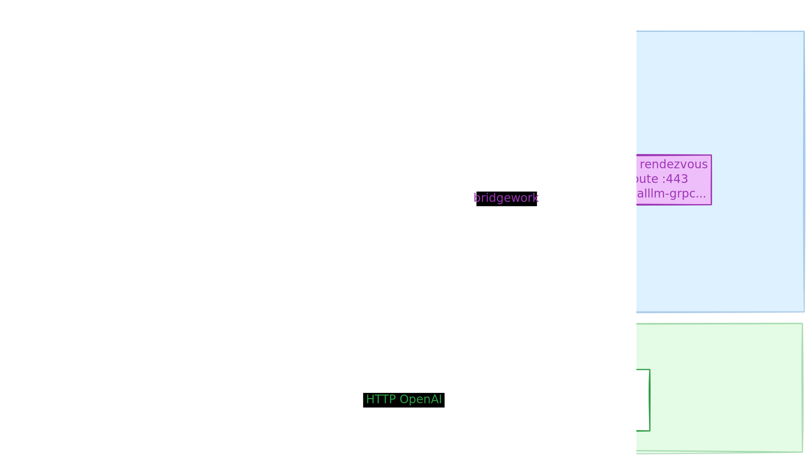

# cf-proxy4localllm

Expose a **local or cloud LLM** (Ollama, OpenAI, or any OpenAI-compatible endpoint) to **Tanzu AI Services** on TPCF via an outbound **gRPC reverse bridge** — no inbound ports on the laptop.

## Architecture



| Component | Runs on | Role |
|-----------|---------|------|
| `hub/` | TPCF CF app | OpenAI HTTP face + gRPC rendezvous |
| `bridge/` | Developer laptop | Outbound gRPC client → hub; HTTP → upstream LLM |
| `proto/` | — | `llmbridge.v1` protobuf definitions |

### Bridge environment

| Variable | Default | Description |
|----------|---------|-------------|
| `HUB_GRPC_ADDR` | `localhost:50051` | Hub gRPC endpoint |
| `HUB_GRPC_TLS` | `false` | Use TLS (required for CF HTTP/2 gRPC route) |
| `BRIDGE_TOKEN` | `dev-token` | Shared secret with hub |
| `UPSTREAM_BASE_URL` | `http://127.0.0.1:11434/v1` | OpenAI-compatible upstream (Ollama, OpenAI, etc.) |
| `UPSTREAM_API_KEY` | *(empty)* | Bearer token for cloud APIs (OpenAI); omit for local Ollama |
| `OLLAMA_BASE_URL` | *(deprecated)* | Alias of `UPSTREAM_BASE_URL` |
| `DEFAULT_MODEL` | `llama3` | Upstream model tag (e.g. `llama3.2`, `gpt-4.1-mini`) |
| `MODEL_ALIAS` | `local-ollama` | Model name exposed to GenAI tile / CF agents |
| `KEEPALIVE_INTERVAL` | `5s` | Application-level ping interval |

### Hub environment

| Variable | Default | Description |
|----------|---------|-------------|
| `PORT` | `50051` | Listen port (CF sets automatically) |
| `BRIDGE_TOKEN` | `dev-token` | Shared secret with bridge |
| `PROXY_MODEL_ALIAS` | `local-ollama` | Model ID returned by `/v1/models` |
| `PROXY_VALIDATE_INBOUND` | `false` | Require `Authorization: Bearer` on chat |
| `PROXY_INBOUND_API_KEYS` | *(empty)* | Comma-separated inbound API keys |

Hub HTTP timeouts: **300s** upstream chat deadline, **310s** read/write, **120s** idle.

## Prerequisites

- **Go** 1.22+ (`go version`)
- **Upstream LLM** — Ollama (`localhost:11434/v1`), OpenAI (`api.openai.com/v1`), or any OpenAI-compatible HTTP API
- **Cloud Foundry CLI** (`cf`) for CF deployment
- **grpcurl** (optional) for gRPC smoke tests
- **protoc** + `protoc-gen-go` + `protoc-gen-go-grpc` (for `make proto`)

## Quick start (local)

```bash
# Regenerate gRPC stubs (requires protoc, protoc-gen-go, protoc-gen-go-grpc)
make proto

# Verify gen + hub + bridge compile and import stubs
make verify

# Run hub (HTTP + gRPC on :50051 via cmux)
cd hub && BRIDGE_TOKEN=dev-token PORT=50051 go run .

# Run bridge (outbound gRPC client — register + keepalive)
cd bridge && BRIDGE_TOKEN=dev-token HUB_GRPC_ADDR=localhost:50051 go run .

# HTTP smoke tests (bridge must be connected for chat)
curl -s http://localhost:50051/health
curl -s http://localhost:50051/v1/models
curl -s -X POST http://localhost:50051/v1/chat/completions \
  -H 'Content-Type: application/json' \
  -d '{"model":"llama3","messages":[{"role":"user","content":"hi"}]}'
```

## Cloud Foundry

Push from `hub/` after copying and editing vars:

```bash
cd hub
cp vars.yml.example vars.yml   # set cf_domain and bridge_token
./scripts/deploy.sh            # vendors gen/llmbridge, then cf push
```

**Before first push:** run `make vendor` so `hub/vendor/` includes `gen/llmbridge` (local `replace` in go.mod). `.cfignore` intentionally keeps `vendor/` in the upload.

**Platform requirements:**

- `instances: 1` is **mandatory** — multi-instance breaks the single-bridge registry
- `protocol: http2` on the gRPC route requires **EAR HTTP/2 routing** enabled by your platform operator

Dual routes in `manifest.yml`:

- `cf-proxy4localllm.apps.<domain>` — HTTP/1.1 (GenAI, health, `/v1/chat/completions`)
- `cf-proxy4localllm-grpc.apps.<domain>` — `protocol: http2` (bridge outbound gRPC)

After push, connect the laptop bridge:

**Local Ollama** (default):

```bash
export HUB_GRPC_ADDR=cf-proxy4localllm-grpc.apps.<domain>:443
export HUB_GRPC_TLS=true
export BRIDGE_TOKEN='<same secret as vars.yml>'
export DEFAULT_MODEL=llama3.2
export MODEL_ALIAS=local-ollama
cd bridge && ./scripts/run-bridge-tpcf.sh
```

**OpenAI** (swap bridge profile only — no CF redeploy):

```bash
cp bridge/secrets.env.example bridge/secrets.env   # set UPSTREAM_API_KEY
export DEFAULT_MODEL=gpt-4.1-mini
cd bridge && ./scripts/run-bridge-openai.sh
```

## Tanzu AI Services integration

Register the hub as an **off-platform OpenAI-compatible model** in the AI Services tile, then add it to a plan so apps can bind `ai-models`.

Official guide: [Integrate with OpenAI-compatible models hosted elsewhere](https://techdocs.broadcom.com/us/en/vmware-tanzu/platform/ai-services/10-3/ai/how-to-guides-integrate-with-openai-compatible-models-hosted-elsewhere.html)

| Tile field | Example value |
|------------|----------------|
| Model name | `local-ollama` (must match `PROXY_MODEL_ALIAS` / `MODEL_ALIAS`) |
| API base URL | `https://cf-proxy4localllm.apps.<domain>/openai` |
| API key | Same value as `PROXY_INBOUND_API_KEYS` on the hub |
| Capabilities | Chat (streaming supported) |

On the hub (`hub/manifest.yml` or `cf set-env`):

```bash
PROXY_VALIDATE_INBOUND=true
PROXY_INBOUND_API_KEYS=<your-tile-key>
PROXY_MODEL_ALIAS=local-ollama
```

After **Apply changes** on the tile, create or update a **plan** that includes this model, then:

```bash
cf create-service genai-service <plan> local-ollama -c '{"model":"local-ollama"}'
cf bind-service <your-app> local-ollama
```

Verify:

```bash
curl -s https://cf-proxy4localllm.apps.<domain>/health | jq
curl -X POST https://cf-proxy4localllm.apps.<domain>/openai/v1/chat/completions \
  -H 'Authorization: Bearer <your-tile-key>' \
  -H 'Content-Type: application/json' \
  -d '{"model":"local-ollama","messages":[{"role":"user","content":"hi"}],"stream":false}'
```

## Troubleshooting

| Symptom | Likely cause | Fix |
|---------|--------------|-----|
| HTTP **503** `bridge_unavailable` | Bridge not running or disconnected | Start `./scripts/run-bridge-tpcf.sh` in a dedicated terminal; keep it open |
| Chat works then stops after ~10s idle (streaming) | Gorouter idle timeout | Bridge keepalive defaults to **5s** (`KEEPALIVE_INTERVAL=5s`) |
| gRPC **TLS handshake error** | Wrong address or TLS flag | Use `HUB_GRPC_TLS=true` with `:443` on the `-grpc` route |
| Hub **504** on chat | Upstream slower than 300s | Reduce prompt/model size or adjust `hub/timeouts.go` |
| GenAI agent **500** | Often hub 503 or streaming error | Check `/health` — `bridge_connected` must be `true` |
| HTTP **401** on hub | Missing or wrong inbound API key | Set `PROXY_INBOUND_API_KEYS` to match the tile key |
| Wrong model upstream | Tile sends alias `local-ollama` | Set bridge `DEFAULT_MODEL` to real tag; keep `MODEL_ALIAS=local-ollama` |
| OpenAI auth errors | Missing API key on bridge | Set `UPSTREAM_API_KEY` in `bridge/secrets.env` |
| After `cf restage` | Bridge must reconnect | Bridge auto-reconnects with exponential backoff (1s–60s + jitter) |

## Repo layout

```text
cf-proxy4localllm/
├── assets/
│   └── cf-proxy4localllm.svg
├── proto/llmbridge/v1/bridge.proto
├── gen/llmbridge/v1/
├── hub/          # CF app (Go)
├── bridge/       # local daemon (Go)
├── tests/
├── Makefile
└── README.md
```
